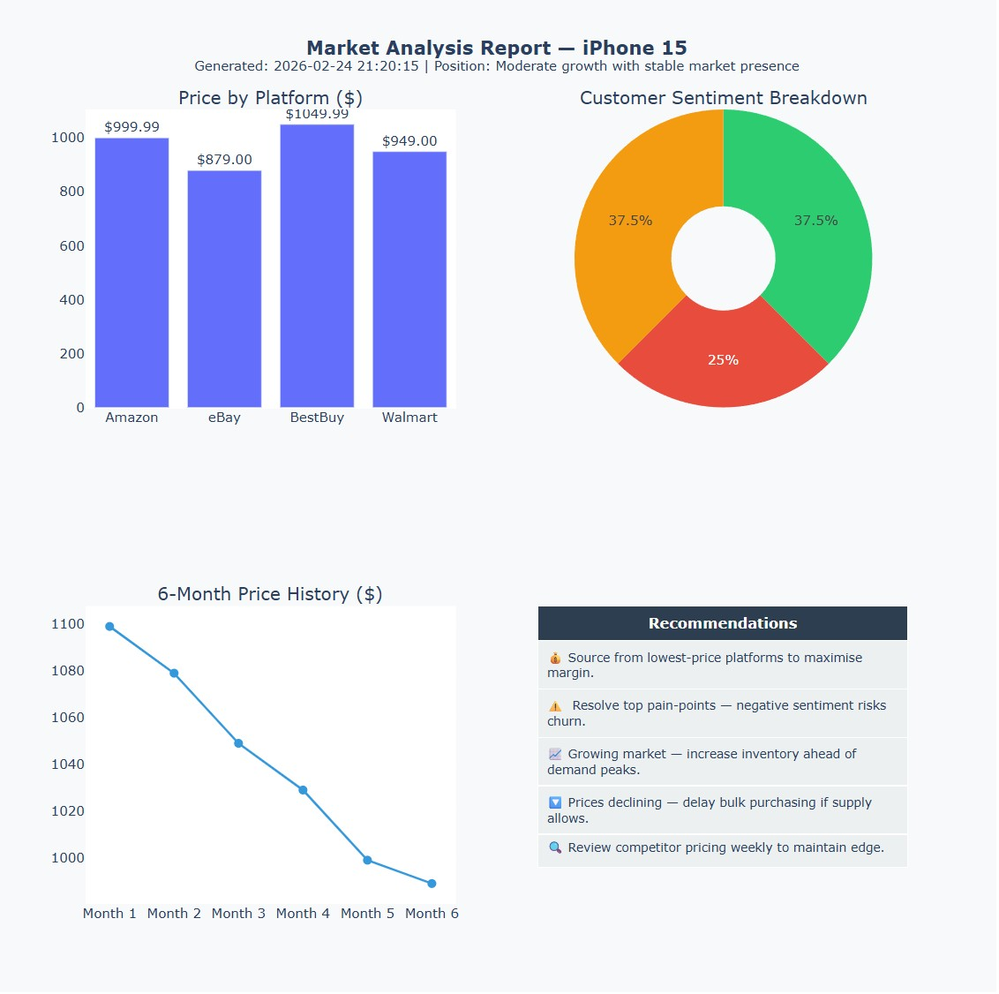

# ecommerce-market-agent


An e-commerce market intelligence agent built with **LangGraph**, **LangChain**,
**FastAPI**, and **uv**. It orchestrates four specialised tools to produce structured
JSON reports and interactive HTML visualizations for any product.

---

## Table of Contents

1. [Architecture](#architecture)
2. [Installation](#installation)
3. [Usage](#usage)
4. [Data Architecture & Storage](#4-data-architecture--storage)
5. [Monitoring & Observability](#5-monitoring--observability)
6. [Scaling & Optimisation](#6-scaling--optimisation)
7. [Continuous Improvement & A/B Testing](#7-continuous-improvement--ab-testing)

---

## Architecture

### Why LangGraph?

LangGraph was chosen over CrewAI, AutoGen, or a native implementation for three reasons:

- **Explicit state machine** — the agent loop is a directed graph, making execution
  flow visible, debuggable, and testable. There are no hidden abstractions.
- **Fine-grained control** — `conditional_edges` let us decide at each step whether
  to continue tool-calling or terminate, which is critical for a multi-step workflow
  where order matters (scrape → analyze → generate report).
- **Native LangChain compatibility** — every LangChain-compatible LLM and tool works
  without adapters. Swapping DeepSeek for GPT-4o is a one-line config change.

A native implementation was considered, but LangGraph provides the same level of
control with significantly less boilerplate for state management and message history.

### Agent loop

```
START
  │
  ▼
agent_node  ──── (no tool calls) ──── END
  │
  │ (tool calls requested by LLM)
  ▼
tool_node
  │
  └──── back to agent_node
```

The LLM follows a strict four-step workflow enforced via the system prompt:
1. `web_scraper` — fetch prices and availability across platforms
2. `sentiment_analyzer` — analyze customer reviews
3. `market_trend_analyzer` — assess price history and competitive landscape
4. `report_generator` — compile all data into a structured report with visualizations

### Project structure

```
ecommerce-market-agent/
├── pyproject.toml
├── .env.example
├── Dockerfile
├── docker-compose.yml
├── README.md
├── src/
│   └── market_agent/
│       ├── config.py           # Settings via pydantic-settings
│       ├── main.py             # FastAPI app entry point
│       ├── agent/
│       │   ├── graph.py        # LangGraph state machine
│       │   └── prompts.py      # System prompt
│       ├── tools/
│       │   ├── base_tool.py    # BaseTool + ToolResult abstractions
│       │   ├── web_scraper.py
│       │   ├── sentiment_analyzer.py
│       │   ├── market_trend.py
│       │   └── report_generator.py
│       └── api/
│           ├── models.py       # Pydantic request/response models
│           └── routes.py       # FastAPI route definitions
└── tests/
    ├── conftest.py
    ├── test_tools/
    ├── test_agent/
    └── test_api/
```

---

## Installation

### Prerequisites

```bash
# Install uv
curl -LsSf https://astral.sh/uv/install.sh | sh
```

### Setup

```bash
git clone <your-repo-url>
cd ecommerce-market-agent

cp .env.example .env
# Edit .env — add your OPENROUTER_API_KEY
# Free key at https://openrouter.ai
# Find free models

uv sync   # installs all dependencies into .venv
```

---

## Usage

### Run locally

```bash
uv run uvicorn market_agent.main:app --reload --port 8000
```

Open [**http://localhost:8000/docs**](http://localhost:8000/docs) for the interactive Swagger UI.

### Run with Docker

```bash
docker compose up --build
```

### Run tests

```bash
uv run pytest -v
```

### Code quality

This project uses [Ruff](https://docs.astral.sh/ruff/) for linting and formatting,
configured in `pyproject.toml`. All files pass `ruff format` and `ruff check`
with zero warnings.

```bash
# Format
uv run ruff format .

# Lint with auto-fix
uv run ruff check . --fix

# Lint only — suitable for CI
uv run ruff check .
```

### API endpoints

| Method | Route | Response | Description |
|---|---|---|---|
| `POST` | `/api/v1/analyze` | `application/json` | Full structured report (default) |
| `POST` | `/api/v1/analyze/html` | `text/html` | Interactive Plotly report for browser |
| `GET`  | `/health` | `application/json` | Health probe |

#### Example — JSON report

```bash
curl -X POST http://localhost:8000/api/v1/analyze \
  -H "Content-Type: application/json" \
  -d '{"product_name": "iPhone 15"}'
```

```json
{
  "success": true,
  "product": "iPhone 15",
  "report": {
    "report_id": "report_iphone_15_20260224_210000",
    "executive_summary": {
      "market_position": "Strong market performer with high customer loyalty",
      "price_competitiveness": "High price variance — significant arbitrage opportunity",
      "customer_sentiment": "Positive customer perception (62% positive, score 7.5/10)",
      "market_momentum": "Slight Decrease"
    },
    "pricing_analysis": { "..." },
    "sentiment_analysis": { "..." },
    "market_trends": { "..." },
    "recommendations": ["..."]
  }
}
```

A full json report example can be seen [here](examples/example_json_report.json)

#### Example — HTML report (open in browser)

```bash
# With curl — save to file
curl -X POST http://localhost:8000/api/v1/analyze/html \
  -H "Content-Type: application/json" \
  -d '{"product_name": "iPhone 15"}' \
  -o report.html && open report.html

# With HTTPie
http POST localhost:8000/api/v1/analyze/html product_name="iPhone 15" > report.html
```

The HTML report contains three interactive Plotly charts:
- **Bar chart** — price comparison across platforms
- **Pie/donut chart** — customer sentiment breakdown
- **Line chart** — 6-month price history trend
- **Table** — business recommendations

The following image showcases an example of that visual report


---

## 4. Data Architecture & Storage

### Recommended stack

| Data type | Store | Rationale |
|---|---|---|
| Analysis results | **PostgreSQL** (JSONB column) | Flexible schema, fully queryable, ACID-compliant |
| Request history / audit log | PostgreSQL | Relational link to results, easy reporting |
| Scraped product cache | **Redis** (TTL 1h) | Sub-millisecond reads, automatic expiry, no stale data |
| Agent & prompt configuration | PostgreSQL or YAML files | Version-controlled via Git, rollback-friendly |

### Schema

```sql
CREATE TABLE analyses (
    id           UUID PRIMARY KEY DEFAULT gen_random_uuid(),
    product      TEXT NOT NULL,
    report       JSONB NOT NULL,
    created_at   TIMESTAMPTZ DEFAULT now()
);
-- Fast lookup by product and recency
CREATE INDEX idx_analyses_product_created ON analyses(product, created_at DESC);

CREATE TABLE request_log (
    id            UUID PRIMARY KEY DEFAULT gen_random_uuid(),
    analysis_id   UUID REFERENCES analyses(id) ON DELETE SET NULL,
    requested_at  TIMESTAMPTZ DEFAULT now(),
    duration_ms   INTEGER,
    model_used    TEXT,
    token_count   INTEGER
);
```

### Caching strategy

Before triggering the agent, the API checks Redis for a cached result:

```
POST /analyze
  │
  ├── cache hit?  → return cached report instantly
  │
  └── cache miss → run agent → store in PostgreSQL → cache in Redis (TTL 1h) → return
```

Cache key: `analysis:{product_name_normalized}` — normalised to lowercase and
stripped of whitespace to maximise hit rate across equivalent requests.
Various strategies like vectorizing could also be used to set the key.

---

## 5. Monitoring & Observability

### Tracing

[LangSmith](https://smith.langchain.com/) is the natural choice — it integrates
natively with LangChain and LangGraph with zero instrumentation code. Every agent
run gets a `run_id` that propagates through all tool calls, making it trivial to
replay a failing execution.

For infrastructure-level tracing, **OpenTelemetry** with a Jaeger or Tempo backend
can complement LangSmith by capturing HTTP latency, database query times, and
inter-service calls in the same trace.

Configuration is a single environment variable:
```bash
LANGCHAIN_TRACING_V2=true
LANGCHAIN_API_KEY=ls_...
```

### Key metrics (Prometheus + Grafana)

| Metric | Type | Alert threshold |
|---|---|---|
| `agent_latency_p95` | Histogram | > 30s |
| `tool_error_rate` | Counter | > 5% over 5 min |
| `llm_tokens_per_request` | Histogram | Spike > 2× baseline |
| `reports_per_minute` | Gauge | Drop to 0 for > 2 min |
| `cache_hit_rate` | Gauge | < 20% (cache misconfigured) |
| `output_quality_score` | Gauge | Rolling avg < 7/10 |

### Output quality measurement

A secondary LLM-as-Judge prompt evaluates each report on four axes:
- **Completeness** — are all sections populated?
- **Accuracy** — does the data match the inputs?
- **Actionability** — are recommendations specific and implementable?
- **Clarity** — is the language concise and unambiguous?

Scores (0–10) are stored in the `analyses` table and feed the `output_quality_score`
metric. An alert fires when the 24-hour rolling average drops below 7.

---

## 6. Scaling & Optimisation

### Handling 100+ simultaneous analyses

The FastAPI app is stateless — each request creates its own LangGraph instance with
no shared mutable state. Horizontal scaling is therefore trivial:

```
Load Balancer (nginx / ALB)
  ├── FastAPI worker 1
  ├── FastAPI worker 2
  └── FastAPI worker N   (Kubernetes HPA scales on CPU / request queue depth)
```

For sustained high load, move the agent execution off the request thread using a
task queue:

```
POST /analyze → enqueue task → return task_id (202 Accepted)
GET /analyze/{task_id} → poll for result
```
This also makes the application fully asynchronous for the client/

**Celery + Redis** is a proven choice for this pattern. It decouples request
acceptance from execution, absorbs traffic spikes, and enables retries on failure.

### Parallelising tool calls

The three data-collection tools (scraper, sentiment, market trend) are independent
and could run concurrently using LangGraph's native fan-out/fan-in pattern. The graph
fans out from an `orchestrator` node into three parallel branches, then joins at
the `report` node which waits for all three tools to complete before synthesising the
final report. This reduces agent latency from the **sum** of all tool times to the
**maximum** of any single tool — approximately 60% faster in practice. The LLM
is only invoked once, for the final synthesis step, which also significantly
reduces token costs.

### LLM cost optimisation

| Strategy | Implementation | Expected saving |
|---|---|---|
| Redis cache identical requests | TTL 1h on `(product, date)` key | 40–60% on repeat queries |
| Reduce LLM interaction | Force tool usage without LLM input | 60% |
| Premium model for synthesis only | GPT-4o for report generator step only | Best quality/cost balance |
| Prompt compression | Remove redundant context from history | 20–30% token reduction |

---

## 7. Continuous Improvement & A/B Testing

### LLM-as-Judge evaluation

After each report is generated, a separate evaluator LLM scores it on the four
axes described in Section 5. The judge prompt is kept intentionally separate from
the agent prompt so it can be updated independently without affecting generation.

```python
judge_prompt = """
You are an expert e-commerce analyst. Rate the following market report on:
- Completeness (0-10): Are pricing, sentiment, trends, and recommendations all present?
- Actionability (0-10): Are recommendations specific and implementable?
- Clarity (0-10): Is the language concise and unambiguous?

Report: {report}

Return a JSON object: {{"completeness": X, "actionability": X, "clarity": X}}
"""
```

### Prompt A/B testing

Each prompt variant is tagged with a `variant_id` (e.g. `system_prompt_v1`,
`system_prompt_v2`). Incoming requests are randomly assigned 50/50 at the route
level. After 100 samples per variant, a Welch's t-test determines whether the
difference in Judge scores is statistically significant (p < 0.05).

```
Request
  │
  ├── variant_id = "v1" (50%) → prompt_v1 → judge score stored
  └── variant_id = "v2" (50%) → prompt_v2 → judge score stored
                                                    │
                                             statistical test
                                             (after n=100 samples)
                                                    │
                                          promote winner as default
```

### User feedback loop

A `/feedback` endpoint accepts structured feedback tied to a `report_id`:

```json
{
  "report_id": "report_iphone_15_...",
  "rating": "thumbs_down",
  "comment": "Recommendations were too generic"
}
```

Negative feedback (thumbs down) triggers two actions automatically:
1. The report is flagged for human review in the admin dashboard.
2. The `variant_id` that produced it receives a penalty score, influencing
   the A/B test outcome faster than Judge scores alone.

### Evolving agent capabilities

New tools are added as LangChain `StructuredTool` objects and registered in
`graph.py`. The system prompt is updated to describe the new capability. Because
the LLM drives tool selection dynamically, no graph restructuring is required for
additive changes — the agent will naturally incorporate new tools into its workflow.

For breaking changes (e.g. changing the report schema), a versioned API approach
is used: `/api/v2/analyze` runs a new graph while `/api/v1/analyze` continues
serving the previous version, enabling zero-downtime migrations.
